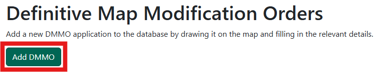
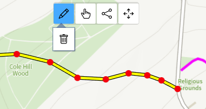
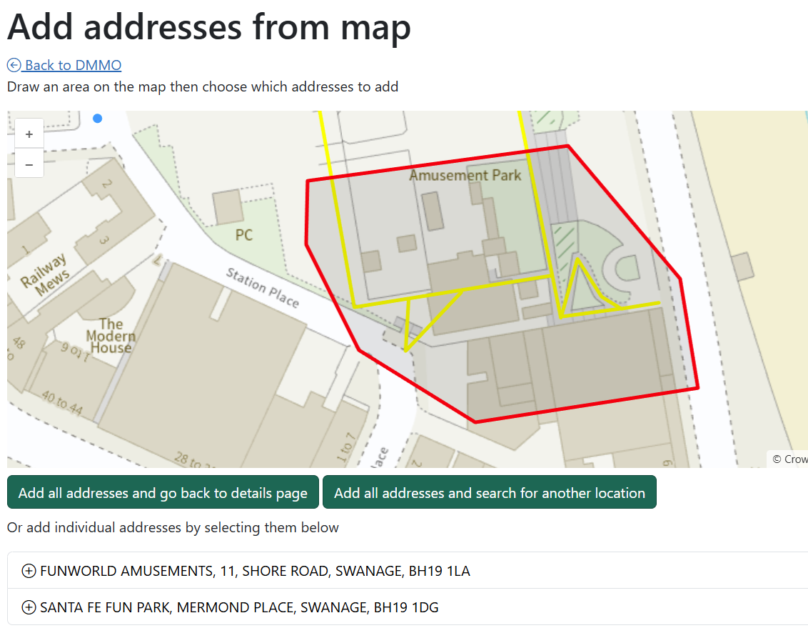

# Definitive Map Modification Orders (DMMOs)

Create, edit and view DMMOs.

!!! note
    Only Rights of Way Officers and Administrators will have access to create and edit.

## Create a new DMMO

Click on the 'Add DMMO' button to get started. 

On the next screen, use the map to find the location you want. Use your mouse-wheel or the <kbd>+</kbd> and <kbd>-</kbd> buttons to zoom in and out and click and drag to move the map. Click on the map to start drawing your route, and keep clicking along where you want your route to go. Double-click to finish and the line will turn yellow. 

If you make a mistake and want to edit your line, click on the Pencil icon on the map to tun on edit mode - you'll see your line highlighted and each node you drew marked as a red circle. Click and drag on any of the nodes to edit your line or add new nodes as you need. To fully delete your drawing and start again, click on the bin icon. To start drawing again, click on the draw icon.

Next fill in the rest of the details as needed:

- Tick if you want the DMMO to be publicly viewable - if you turn this on the details will appear on the council website
- Application type - pick from the dropdown menu
- Claimed status - pick from the dropdown menu
- Case status - pick from the dropdown menu
- Application details (required) - brief details about the DMMO application
- Location description - brief description of where the DMMO is
- Application date (required) - pick a date
- Received date (required) - pick a date
- Determination date - pick a date
- Appeal - choose an option
- Date of appeal - pick a date
- Date of direction of Secretary of State - pick a date
- Case officer - start typing to bring up a list of names and pick one or type one in yourself
- Private comments - any comments that you want to remain internal
- Public comments - any comments that you want to appear on the council website

Click on 'Create' once you're done and you'll be taken to a details page where you can make changes or add events, documents, contacts, affected addresses and more (see the edit DMMO section below).

## Search for a DMMO

Search for DMMOs in a number of ways:

- Search by DMMO reference number
- Search using other information including location, status, date ranges and more

If your search finds only one DMMO, you'll be taken straight to the details. If your search brings back more than one result, you'll see the results in a table and can click on the one you want.

## Edit a DMMO

Search for the DMMO you want to edit and click on the 'Edit' button.

You can edit the route on the map and any of the other details as needed. Click 'Update' when you're done.

You can also add other details to a DMMO without clicking on Edit but by scrolling down and going to each section.

### Event log
Add events by typing in the text box and click on 'Add event'. Edit and delete events by using the 'Edit' and 'Delete' buttons.

### Orders
Add orders by clicking on the 'Create new order' button, fill in the details on the next page as needed and click 'Create'. The order will now appear and you can click on it to view the full details. Edit and delete orders by using the 'Edit' and 'Delete' buttons.

### Contacts
Add contact details by clicking on the 'Add contact' button. Fill in the details as needed and hit Save. Edit and delete contacts by using the 'Edit' and 'Delete' buttons.

### Affected addresses
Add any addresses that will be affected by the DMMO. You can add addresses in two ways:

- Add address - search for a postcode and pick from a list. You can pick multiple addresses and a green tick will appear when successful. If the address you want is not in the list, click on 'Enter an address manually' and type it in. Cross off the window when you're done and the addresses will be added
- Add addresses from map - draw an area on the map around the addresses you want to include. A list will appear below the map of all addresses that are within your shape. You can either add all the addresses by using the buttons or pick the ones you want. Green ticks will appear next to the addresses when successful. Click on 'Back to DMMO' to return to the DMMO details

Delete an address by clicking on the 'Delete' button next the the address.

### Linked routes
Add any Rights of Way that will be affected by the DMMO. You can add linked routes in two ways:

- Add linked route - add routes that are nearby. You can pick multiple routes and a green tick will appear when successful. Cross off the window when you are done to add the routes. If the route you want isn't in the list, search for it using the route code box and click on the 'Add linked route' button 
- Add linked routes from map - click on any of the routes on the map to link them to the DMMO, they will appear listed below the map. Click on a route again to unlink it. Click on 'Back to DMMO' to return to the DMMO details when you're done

Delete a route by clicking on the 'Delete' button next the the route.

### Parishes
Parishes affected by the DMMO will be automatically listed.

### Media
Add media to any of the sections by clicking the 'Choose files' button or by dragging and dropping. You can add multiple media items and rotate them if you need to. Delete a media item by clicking on the 'Delete' button. Download a copy of the media item by clicking on the download icon.

