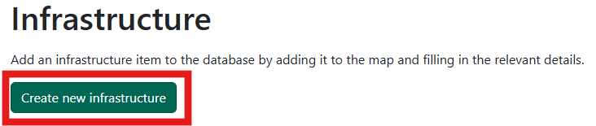
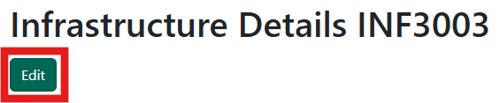

# Infrastructure

!!! note 
    Only Rangers and Administrators will have access to create and edit.

## Search for insfrastructure

Search for infrastructure using:

- an Infrastructure ID number
- other information including the team responsible, type, date ranges and more

If your search finds only one result, you'll be taken straight to the details. If your search brings back more than one result, you'll see the results in a table and can click on the one you want.

## Create a new infrastructure item

Click on the 'Create new infrastructure' button to get started. 

{: style="height:125px"}

On the next screen, use the map to find the location you want. Use your mouse-wheel or the <kbd>+</kbd> and <kbd>-</kbd> buttons to zoom in and out and click and drag to move the map. Click on the map to place a point - if you get it wrong, just click again.

!!! note 
    Your infrastructure item must be near a Right of Way.

Next fill in the rest of the details as needed:

- Route code (required) - should already be filled in based on where you clicked on the map. If it's incorrect you can change it
- Infrastructure type - pick from the dropdown list
- Length in metres
- Width in metres
- Height in metres
- Description - a brief description if needed
- Installation - pick a date

Click on 'Create' once you're done and you'll be taken to a details page where you can make changes, view surveys or add photos (see the edit infrastructure item section below).

## Edit an infrastructure item

Search for the infrastructure item you want to edit and click on the 'Edit' button.

{: style="height:100px"}

You can edit the location of the pin on the map and any of the other details as needed. If your infrastructure is a bridge, fill in any details as needed. Click 'Update' when you're done.

You can also add other details to an infrastructure item without clicking on Edit but by scrolling down and going to each section.

### Bridge details (if it's a bridge)
If any bridge details have been added, see them in full here. To add details click on 'Edit' at the top of the page.

### Surveys
See details of any completed surveys, click on the 'View survey' button to see the full survey.

See the [surveys page](./surveys.md) for more information about how to create, edit and approve surveys.

### Media
Add any photos or videos by clicking the 'Choose files' button or by dragging and dropping. You can add multiple media items and rotate them if you need to. Delete a media item by clicking on the 'Delete' button. Download a copy of the media item by clicking on the download icon.

