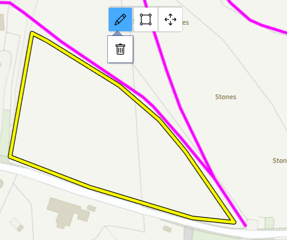
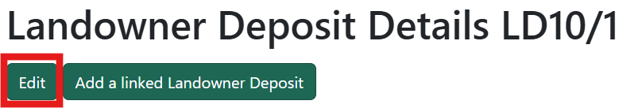

# Landowner Deposits

Create, edit and view Landowner Deposits.

!!! note
  Only Rights of Way Officers and Administrators will have access to create and edit.

## Create a new Landowner Deposit

Click on the 'Create' button to get started. 

On the next screen, use the map to find the location you want. Use your mouse-wheel or the <kbd>+</kbd> and <kbd>-</kbd> buttons to zoom in and out and click and drag to move the map. Click on the map to start drawing your polygon, and keep clicking where you want your shape to go. Close your shape to finish and the polygon will turn yellow. 

If you make a mistake and want to edit your polygon, click on the Pencil icon on the map to tun on edit mode - you'll see your polygon highlighted. Click and drag on the line to edit your polygon. To fully delete your drawing and start again, click on the bin icon. To start drawing again, click on the draw icon.

Next fill in the rest of the details as needed:

- Type - tick one or multiple types
- Received date (required) - pick a date
- Location description (required) - brief description of where the Landowner Deposit is
- Form completed correctly - tick if correct
- Map attached to correct scale - tick if correct
- Fee paid - tick if paid
- All signed who should - tick if correct
- Date acknowledged receipt - pick a date
- Cheque receipt number - type in a number
- Date cheque paid in - pick a date
- Date notice drafted - pick a date
- Website notice published - pick a date
- Email notice sent - pick a date
- Onsite notice erected - pick a date
- Website entry printed - pick a date
- Date sent to archive - pick a date
- Archive reference - type a reference number
- Primary contact - start typing to bring up a list of names and pick one or type one in yourself

Click on 'Create' once you're done and you'll be taken to a details page where you can make changes or add events, documents, contacts, affected addresses and more (see the edit Landowner Deposit section below).

## Search for a Landowner Deposit

Search for Landowner Deposits in a number of ways:

- Search by Landowner Deposit ID number
- Search using location or parish

If your search finds only one Landowner Deposit, you'll be taken straight to the details. If your search brings back more than one result, you'll see the results in a table and can click on the one you want.

## Edit a Landowner Deposit

Search for the Landowner Deposit you want to edit and click on the 'Edit' button.

You can edit the polygon on the map and any of the other details as needed. Click 'Update' when you're done.

You can also add other details to a Landowner Deposit without clicking on Edit but by scrolling down and going to each section.

### Contacts
Add contact details by clicking on the 'Add contact' button. Fill in the details as needed and hit Save. Edit and delete contacts by using the 'Edit' and 'Delete' buttons.

### Event log
Add events by typing in the text box and click on 'Add event'. Edit and delete events by using the 'Edit' and 'Delete' buttons.

### Affected addresses
Add any addresses that will be affected by the Landowner Deposit. You can add addresses in two ways:

- Add address - search for a postcode and pick from a list. You can pick multiple addresses and a green tick will appear when successful. If the address you want is not in the list, click on 'Enter an address manually' and type it in. Cross off the window when you're done and the addresses will be added
- Add addresses from map - draw an area on the map around the addresses you want to include. A list will appear below the map of all addresses that are within your shape. You can either add all the addresses by using the buttons or pick the ones you want. Green ticks will appear next to the addresses when successful. Click on 'Back to Landowner Deposit' to return to the Landowner Deposit details

Delete an address by clicking on the 'Delete' button next the the address.

### Parishes
Parishes affected by the Landowner Deposit will be automatically listed.

### Media
Add media to any of the sections by clicking the 'Choose files' button or by dragging and dropping. You can add multiple media items and rotate them if you need to. Delete a media item by clicking on the 'Delete' button. Download a copy of the media item by clicking on the download icon.

### Linked deposits
See any linked Landowner Deposits. Add a linked Landowner Deposit by clicking the 'Add a linked Landowner Deposit' button in the Linked Deposits section or use the button at the top of the page. A new page will open and you can create a Landowner Deposit as you usually would by drawing it on the map and filling the in the details.