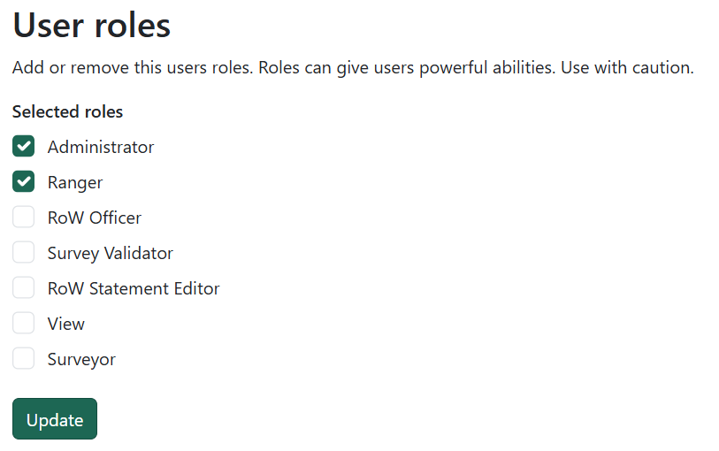

# Management

!!! note
    Only Administators will be able to access this page.

Use the management area to manage users and roles, and to check audit logs. To get to the management area, click on your name at the top-right of the screen and select 'Manage application'.

## Users

Click on Users to go to the user management page where you can manage users and assign roles.

### Active users

Active users are people who have access to the application. Click on any of them to find out more and see what roles they have.

!!! warning
    Roles can give users powerful abilities and control what they see and what they can and can't do - use with caution!

Add or remove a user's roles by choosing the ones you want and click on the 'Update' button to save.

{: style="height:300px"}

### Available users

Available users are people who do not have access to the application but are available to add.

Search for a user you want to give access by using the search boxes and click on the user. Add a role and click on the 'Update' button to give them access to the application. Next time they try and access the application, they will be logged in automatically, no need for a password.

## Audit log

The audit log shows a list of actions taken by all users listed by date. Click on any of the rows to view more details.

!!! info "Want to see audit logs for a specific thing?"
    Audit logs are also available on the details pages of every Right of Way, maintenance job, infrastructure item, DMMO, PPO and Landowner Deposit.
