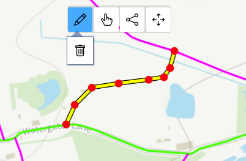
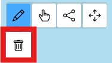

# Public Path Orders (PPOs)

!!! note
    Only Rights of Way Officers and Administrators will have access to create and edit.

## Search for a PPO

Search for PPOs using:

- a PPO reference number
- other information including location, status, date ranges and more

If your search finds only one PPO, you'll be taken straight to the details. If your search brings back more than one result, you'll see the results in a table and can click on the one you want.

## Create a new PPO

Click on the 'Create new PPO' button to get started. 

{: style="height:125px"}

On the next screen, use the map to find the location you want. Use your mouse-wheel or the <kbd>+</kbd> and <kbd>-</kbd> buttons to zoom in and out and click and drag to move the map. Click on the map to start drawing your route, and keep clicking along where you want your route to go. Double-click to finish and the line will turn yellow. 

If you make a mistake and want to edit your line, click on the Pencil icon on the map to turn on edit mode - you'll see your line highlighted and each node you drew marked as a red circle. Click and drag on any of the nodes to edit your line or add new nodes as you need. 

To fully delete your drawing and start again, click on the bin icon. 

To start drawing again, click on the draw icon.

Next fill in the rest of the details as needed:

- Tick if you want the PPO to be publicly viewable - if you turn this on the details will appear on the council website
- Application type (required) - pick from the dropdown menu
- Application intent - tick one or multiple intents
- Case status (required) - pick from the dropdown menu
- Priority (required) - pick from the dropdown menu
- Application details (required) - brief details about the PPO application
- Location description - brief description of where the PPO is
- Received date (required) - pick a date
- Determination date - pick a date
- Date of direction - pick a date
- Inspection and certification - choose an option
- Date of inspection and certification - pick a date
- Date confirmation published - pick a date
- Council-owned land affected - pick an option
- Charge - type in the charge amount
- Box number - type in the box number
- Case officer - start typing to bring up a list of names and pick one or type one in yourself
- Private comments - any comments that you want to remain internal
- Public comments - any comments that you want to appear on the council website

Click on 'Create' once you're done and you'll be taken to a details page where you can make changes or add events, documents, contacts and more (see the edit PPO section below).

## Edit a PPO

Search for the PPO you want to edit and click on the 'Edit' button.

{: style="height:100px"}

You can edit the route on the map and any of the other details as needed. Click 'Update' when you're done.

You can also add other details to a PPO without clicking on Edit but by scrolling down and going to each section.

### Event log
Add events by typing in the text box and click on 'Add event'. Edit and delete events by using the 'Edit' and 'Delete' buttons.

### Orders
Add orders by clicking on the 'Create new order' button, fill in the details on the next page as needed and click 'Create'. The order will now appear and you can click on it to view the full details. Edit and delete orders by using the 'Edit' and 'Delete' buttons.

### Contacts
Add contact details by clicking on the 'Add contact' button. Fill in the details as needed and hit Save. Edit and delete contacts by using the 'Edit' and 'Delete' buttons.

### Parishes
Parishes affected by the PPO will be automatically listed.

### Media
Add media to any of the sections by clicking the 'Choose files' button or by dragging and dropping. You can add multiple media items and rotate them if you need to. Delete a media item by clicking on the 'Delete' button. Download a copy of the media item by clicking on the download icon.

