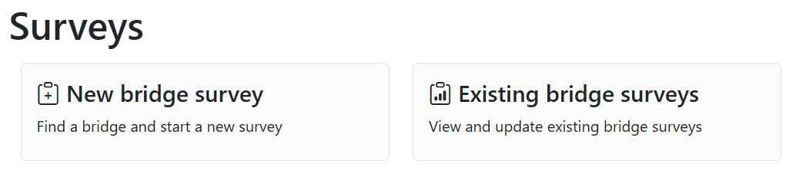
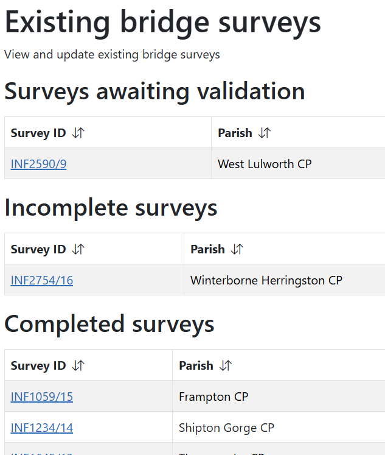
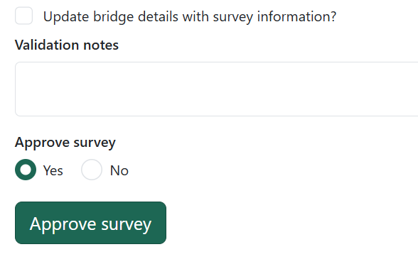

# Surveys

Create, update and view bridge surveys.

!!! note
    Only Surveyors, Survey Validators, Rangers and Administrators will have access to create or validate surveys.

## New bridge survey

Create a new bridge survey by clicking on 'New bridge survey'.

There are three ways to find the bridge you want:

- Search for it using it's Infrastructure ID number
- If you're onsite at the bridge, use your device location to find the bridge near you
- Use the map to find the bridge and click on it, then click on 'Start a bridge survey'

Once you've found your bridge, click on 'Start now' to begin your survey. You'll be asked if you're onsite at the bridge or not, choose the option that suits you.

You'll be asked a series of questions about the materials the bridge is made of, its condition and any repairs needed. At the end you can also upload any photos or videos you have.

Before you finish, you'll be shown a summary of your survey you can check through and change any of the things you have filled in.

If you're ready to submit, click on the 'Submit survey' button. You can also save what you've done and finish later. If you need to go back to it later, see the incomplete surveys section below for how to find it again.

## Existing bridge surveys

Click on 'Existing bridge surveys' to check surveys that are waiting for validation, are incomplete or view complete surveys.

### Validating a survey

Any surveys awaiting validation will appear under surveys awaiting validation. Click on one to go to it. You'll be taken to a page that summarises the survey, click on the 'Check this survey' button to see the full details.

At the bottom of the page, you'll have some options to fill in:

- Tick the box if you want to update the bridge details with the survey information
- Validation notes - type any notes you have, including any reasons why you are rejecting a survey
- Approve survey - choose whether to approve the survey or not

Click on 'Approve survey' if you're approving or 'Reject survey' if you're rejecting.

### Incomplete surveys

Any incomplete surveys will be listed under incomplete surveys - this includes any surveys you have started but not yet submitted. Click on a survey to go to the details where you can change anything you need.

If you're ready to submit, click on the 'Submit survey' button. You can also save what you've done and finish later.

### Complete surveys

View details of any completed surveys by clicking on the one you want. You can also see the status of a survey and see if it was verified or rejected

